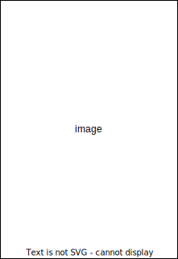

## Markdown Preview Enhanced report format

[Visual Studio Code](https://code.visualstudio.com/),[Atom](https://atom.io/)の拡張機能[Markdown Preview Enhanced](https://github.com/shd101wyy/markdown-preview-enhanced)の拡張スクリプトです。  
図,表,式の番号を自動で振る、参照を自動で振るなどMarkdownをレポートに特化したフォーマットに自動で変換します。  


[Markdown Preview Enhanced](https://github.com/shd101wyy/markdown-preview-enhanced)の機能についてはこちらを参照してください。  

[Markdown Preview Enhanced 日本語ドキュメント](https://shd101wyy.github.io/markdown-preview-enhanced/#/ja-jp/)

## 導入方法
Previewを一度以上開いた後、`Ctrl-Shift-P`を押して、    
`Markdown Preview Enhanced：Extend Parser`コマンドを実行します。   
次に、このリポジトリの`parser.js`ファイルの内容を開かれた`parser.js`ファイルのコピー＆ペーストしてください。
  
同様に、`Markdown Preview Enhanced: Customize Css`コマンドを実行します。   
次に、このリポジトリの`style.less`ファイルの内容を開かれた`style.less`ファイルのコピー＆ペーストしてください。

## ドキュメント

### 表紙を作成する

```
^^^cover
title: タイトル
subtitle: サブタイトル
sub_date: 提出日
exp_date: 実験日
subject: 授業科目
teacher: 担当教員
number: 学籍番号
name: 氏名
depart: 学科
collab: 共同実験者
desk: 使用デスク
^^^
```


表紙をつけるには、このようなフロントマターをファイルの先頭に書きます。
明示的に設定していない項目は表示されません。

### 目次を作成する
自動でやってくれます

### 図,表,プログラム, 式に番号をふる
自動でやってくれます

### 画像にキャプションをつける

```

```

### 画像のレイアウトを変更する
#### flex

```
<flex>要素で囲みます.

<flex>
  
  
<flex>
```

画像を回り込むように表示します

#### grid

### 表にキャプションをつける
### プログラムにキャプションをつける

### ラベルを貼る & 参照する

### 改ページする

### 設定を変更する

